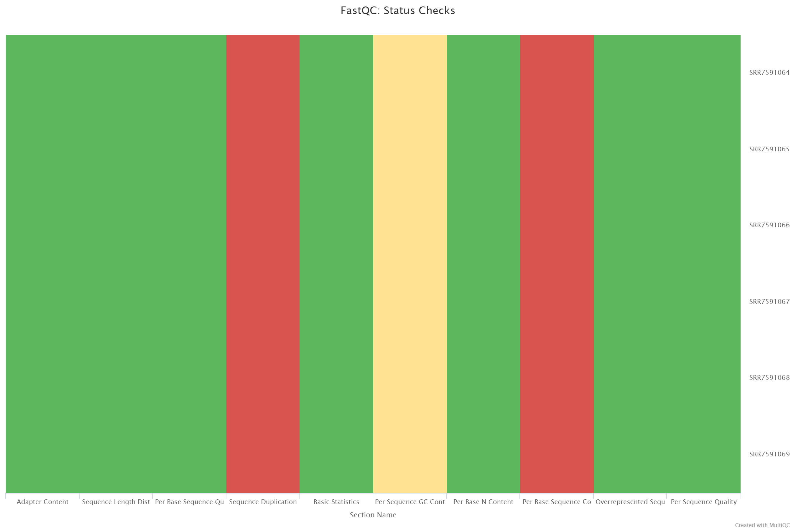
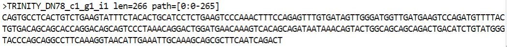
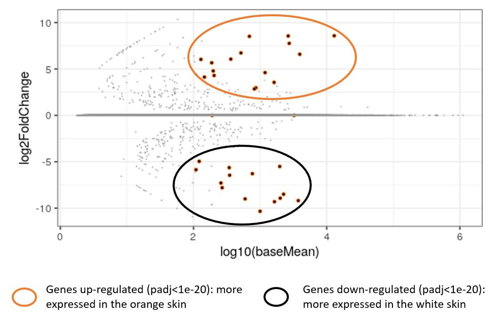
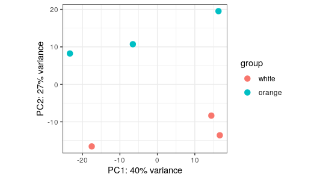

# TP NGS clownfish 2020

## Scientific question 
Color pattern is an extremely important ecological factor in fishes, with impact on mating, camouflage, _etc_. 
White tissues in Actinopterygean fishes can be due to iridophores (reflective tissue) or leucophores (white tissue). For instance, zebra fish _Danio rerio_'s white stripes are due to iridophores, whereas different white tissues of cuttlefish are due to various combination of leucophores and iridophores.  
In this study, we will analyze RNA-seq data to determine whether _Amphiprion ocellaris_ white stripes are composed of leucophores or iridohpores, and to further analyze genes differentially expressed in the white stripes compared to the orange stripes. 

 
### Dataset used 
The dataset used can be found on NCBI SRA dataset, under the project name  PRJNA482578. 
We analyzed RNA-seq data from 6 different conditions:
* SRR7591064 - Orange skin - ind 2
* SRR7591065 - White skin - ind 3
* SRR7591066 - Orange skin - ind 1
* SRR7591067 - Orange skin - ind 3
* SRR7591068 - White skin - ind 1
* SRR7591069 - White skin - ind 2 

We have 3 replicates for each condition. 

### Reference of the paper

Salis P, Lorin T, Lewis V, Rey C, Marcionetti A, Escande M-L, Roux N, Besseau L, Salamin N, Sémon M, et al.: **Developmental and comparative transcriptomic identification of iridophore contribution to white barring in clownfish.** _Pigment Cell & Melanoma Research_ 2019, **32**:391–402.

## Steps of the analysis:

### Downloading the SRA data
Download of the SRA data using fastq-dump in a for loop.The read's name are changed using an awk code, so that they end with "/1" (needed for trinity processing of the reads).   
Code named _download_fastq.sh_

SRR accession codes of the data used: SRR7591064, SRR7591065, SRR7591066, SRR7591067, SRR7591068, and SRR7591069

### Checking the quality of the reads
Check the quality of the reads for each file individually in a for loop using fastqc.  
Code named _fastqc.sh_

Check the quality of the reads for all files at once using multiqc.  
Code named _multiqc_

The summary of the multiqc analysis is shown below (similar results were found with each individual fastqc):

 

The parameters flagged by fastqc and multiqc are: 
- per-base sequence content where we observe a non-random nucleotide composition of the beginning of the reads, probably due to a defect in the random primers used for the reverse transcriptase. 
- sequence duplicated levels are at a normal level for a RNA-seq, but they are flagged since in a DNA-seq experiment they would indicate a problem.

Except the unsolvable problem of RT primers, the reads have an overall good quality, so there is no need for a step to "clean" the reads.

### _De novo_ assembly of the reads 
We want to assemble all the reads in transcripts. This can be done by mapping the reads to a reference genome, or by a _de novo_ transcriptome assembly. In this case, we have a reference genome available for _A. ocellaris_, but we will reproduce the analysis done in the paper.   

We assembled the reads from all FASTQ files to get a transcriptome using Trinity. The Illumina sequencing performed generated single-end (--single) and strand-specific R (--SS_lib_type R) reads, so we have to specify these options to Trinity.  
Code named _trinity.sh_

Example of transcript we get after the transcriptome assembly by Trinity: 


### Quantification of the expression level of the mRNA
Quantifies the level of expression of each Trinity transcript using salmon. Salmon works in two steps, with first salmon index, which indexes the Trinity transcriptome and salmon quant ,  which count how many reads map to each transcript.
Different values of "k" (25, 27 and 29) were used in the group to see which enabled the best alignment: a 25-mer turned to provide the best alignment. All tried values showed alignment between 92.5% and 96%, which is satisfactory. 
Code named _salmon.sh_

### Annotation of the transcripts
We now want to annotate the transcripts, so we can link our results (quantification of trabscripts expression) with known genes of _S.partitus_. 
We will annotate the transcript by blasting them with the closest available reference genome, which in our case is _S.partitus_. We therefore have to get the _S.partitus_ genome from Ensembl, to find the likely coding sequence  of the trinity transcripts using Transdecoder, and to blast the likely coding sequence on the _S.partitus_ reference genome.    

#### Downloading the closest available reference genome 

We downloaded the _S.partitus_ genome (coding sequence) from Ensembl (release 102).
The data were available on ftp.ensembl.org, and we downloaded them using wget.  
Code named _get_ref_genome.sh_

We then renamed the downloaded reference genome to keep the Ensembl identifier (starting with ENS) (gene) and the name of the gene (gene_symbol) when there is one. This was done with an awk code.  
Code named _rename_genome_ref.awk_

#### Identification of coding sequences on the transcripts
We used TransDecoder to identify coding sequences in the transcripts assembled by trinity. Transdecoder works in three steps, with the second one being optionnal (which was skipped here). TransDecoder.LongOrfs identifies ORF (ie recognizes start and stop codon on the transcript) and TransDecoder.Predict was used to keep the ORF most likely to be the actual coding sequence by transcript . Here we used TransDecoder.Predict to keep the longest ORF, assuming that the longest ORF is the most likely to be the actual coding sequence.

We used the option "-S" because the transcripts are strand-specific (because they reconstituted from strand-specific RNA-seq data) and "--gene_trans_map" (used later on) for TransDecoder.LongOrfs. 

Code named _transdecoder.sh_

#### Blast 
We blasted coding sequences (found by TransDecoder) on the _S.partitus_ genome database. 
The code works in two steps, with the first step consisting of creating a _S;partitus_ genome database in a format usable by blast with the function _makeblastdb_, and the second step being the blast in itself. 
Code named _blast.sh_

### Differential expression analysis 
We used DESeq2 to analyze differential expression of transcripts between the orange and the white condition, because classical statistical approach can not be used with the low number of replicates we have (three in this case). 
DESeq2 corrects the dispersion of individual gene count so it fits the expected curve of dispersion as a function of gene count. It also takes into account the fact that multiple tests are done, and so corrects the p-value to take into account the expected false positive due to the multiplicity of tests.  
DESeq2 being part of a R package, the code is written in R language. 

We chose to use the "white" condition as a reference for further analysis. 

#### MA plot construction 
A MA plot is graph showing the log2FoldChange of transcripts as a function of log10(baseMean). 

Both the function _results_ and _lfcShrink_ type "apeglm" were used in this analysis, in order to compare them. _results_ shows a log2FoldChange dependent on log10(baseMean), whereas this relation is weakened with the function _lfcShrink_. This ...

 

#### Volcano plot construction 
A volcano plot is a graph showing the -log10(padj) as a function of log2FoldChange. we therefore see in the upper left part of the graph genes significatively less expressed in orange skin (and reciprocally more expressed in white skin), and in the upper right part genes significantly more expressed in orange skin (and less expressed in white skin). 

_add an image_

#### PCA construction

 

We see that the second component efficiently separates the samples on the skin color. However, it might be surprising to see at first that the principal component seem to separate individuals within a same skin color. This means that the variation between individuals is great in this experiment, likely because the individuals do not come from an homogenous genetic background.  

#### Manual annotation of top differentially expressed genes

We recovered 16 genes upregulated in orange skin with a adjusted p-value <1e-10, and 14 downregulated genes in orange skin with an adjusted p-value <1e-10. We used the blast output to recover gene names from Trinity transcript ID of the top differentially expressed genes (meaning those with the lower adjusted p-value. However, due to an error in _rename_genome_ref.awk_, we observed mismatch between transcript ID and genes common names. We therefore used the correspondance between Transcript ID and Ensembl names of the genes obtained from the blast output and then searched for common names of genes from the Ensembl names on the Ensembl database. 

This allows us to compare our results with the results found in the paper. 
It must be noted that our analysis differ from the paper in some ways. For instance, we used the function _lfcShrink_ whereas the authors used the function _results_. Other differences include some options (I used a k=29 _check_ for instance) and updates of the softwares between the time the paper was written and December 2020. Despite these small differences in the analysis, we overall find similar top differentially expressed genes: 7 of our top 10 differentially expressed genes are found in the paper's top 10 differentially expressed genes. We also found in our result the gene _saiyan_, which was further analyzed in the paper. Overall, our results our consistent  

```

```

